<picture>
  <source media="(prefers-color-scheme: dark)" srcset="assets/banner-dark-v2.svg">
  <source media="(prefers-color-scheme: light)" srcset="assets/banner-light-v2.svg">
  
</picture>

I design and build websites for businesses that need theirs to actually do something — book a table, take an order, bring in a lead. Three years in, 60+ sites shipped across 15 countries.

I work across two studios:

**[ViperTech CR](https://vipertechcr.com)** — co-founder. A two-person studio in Guápiles, Costa Rica, building corporate sites, online stores and landing pages for companies across Latin America. You talk to the person who designs it and the person who builds it. No account managers, no handoffs.

**[Resto Experience](https://restoexp.com/)** — frontend UI/UX developer. Restaurants, bars, cafés and beverage brands in the United States and Latin America. I maintain a portfolio of 20+ active sites there across Next.js/Vercel and WordPress/Elementor, and I build the accessibility tooling for the vertical.

  
  
  
  
  
  

## What I work on

**Custom frontend builds.** Next.js and TypeScript when the site needs to be fast, indexable and genuinely bespoke — motion built with GSAP, layouts drawn in Figma before a line of code is written.

**WordPress that survives a handoff.** Elementor builds a client can actually maintain, plus the unglamorous half: Core Web Vitals, technical SEO, DNS, Search Console, backups, and cleaning up sites after someone else broke them.

**Accessibility built in, not bolted on.** Keyboard navigation, visible focus, real contrast ratios and `prefers-reduced-motion` respected from the first commit. In the restaurant vertical almost nobody does this, and ADA complaints against restaurant websites are not hypothetical.

## Stack

**Frontend**

**Platforms & CMS**

**Backend & data**

**Design, tooling & ops**

I pick the platform for the project, not for my own convenience. If a client's team is going to edit the site every week, that decision looks very different than if they never touch it again.

## Selected work

### ![](https://img.shields.io/badge/-DB1B34?style=flat-square&logo=data:image/svg%2Bxml;base64,PHN2ZyB4bWxucz0iaHR0cDovL3d3dy53My5vcmcvMjAwMC9zdmciIHZpZXdCb3g9IjAgMCAyNTEgMjU3Ij48ZyB0cmFuc2Zvcm09InRyYW5zbGF0ZSgwLjAwMDAwMCwyNTcuMDAwMDAwKSBzY2FsZSgwLjEwMDAwMCwtMC4xMDAwMDApIiBmaWxsPSIjRkZGRkZGIiBzdHJva2U9Im5vbmUiPjxwYXRoIGQ9Ik02NjggMjE4OCBsLTMgLTM4MiAtMTUwIDE1NSBjLTgyIDg1IC0xODAgMTg1IC0yMTggMjIzIGwtNjggNzAgLTc1Ci03NSBjLTQyIC00MCAtODkgLTkxIC0xMDYgLTExMiBsLTMxIC0zOSAyNzkgLTI4MSAyNzkgLTI4MiAtMjgzIC0zIC0yODMgLTIgMwotMTUzIDMgLTE1MiAyNzkgLTUgMjgwIC01IC0yNzkgLTI4MyAtMjc5IC0yODMgMTA4IC0xMDcgMTA4IC0xMDcgMjA3IDIxMgpjMTE0IDExNyAyMTIgMjEzIDIxNyAyMTMgbDEwIDAgLTEgLTM2NyAwIC0zNjggMTU4IC0zIDE1NyAtMyAwIDUzMyAwIDUzMyAtOTAKOTAgYy00OSA0OSAtOTAgOTYgLTkwIDEwMyAwIDggNDEgNTQgOTAgMTAzIGw5MCA4OCAwIDUzNSAwIDUzNiAtMTU1IDAgLTE1NSAwCi0yIC0zODJ6Ii8+PHBhdGggZD0iTTExODIgMjU2MSBsLTE0IC04IDE1IC0yOSBjMTQgLTI4IDI0NSAtNTk3IDQwNSAtOTk5IDQxIC0xMDQgODAKLTE5NiA4NSAtMjAzIGwxMCAtMTIgMTU0IDIgMTU0IDMgMTQwIDM0MCBjMjMxIDU2MCAyNzAgNjU1IDMxNiA3NzAgMjQgNjEgNDcKMTE2IDUwIDEyMyBsNSAxMiAtMTYwIDAgLTE1OSAwIC0zMyAtOTIgYy0xOCAtNTEgLTY0IC0xNzYgLTEwMyAtMjc4IC0zOCAtMTAyCi0xMDAgLTI3MCAtMTM3IC0zNzUgLTM4IC0xMDQgLTcyIC0xOTEgLTc3IC0xOTIgLTUgLTIgLTE3IDIzIC0yNyA1NCAtMTAgMzIKLTU5IDE3MSAtMTA4IDMwOCAtNTAgMTM4IC0xMTUgMzIzIC0xNDcgNDEyIGwtNTYgMTYyIC0yMCA1IGMtMzIgOSAtMjc5IDYKLTI5MyAtM3oiLz48cGF0aCBkPSJNMTIwMCAxMTI2IGwwIC0xMTQgMTYgLTYgYzkgLTMgMTA2IC02IDIxNyAtNiBsMjAyIDAgLTMgLTQxNyBjLTIKLTIzMCAtMSAtNDU1IDMgLTUwMCBsNyAtODMgMTQ0IDAgMTQ0IDAgMCA1MDAgMCA1MDAgMjIwIDAgMjIwIDAgMCAxMjAgMCAxMjAKLTU4NSAwIC01ODUgMCAwIC0xMTR6Ii8+PC9nPjwvc3ZnPg==) ViperTech CR

| Project | What it is | Built with | |
|---|---|---|---|
| **Tricad Eco Energy** | Solar and energy-efficiency engineering firm | Multipage · SEO | [Live ↗](https://tricadecoenergy.com/) |
| **Inmoxo** | Real-estate platform with listings and financing | E-commerce | [Live ↗](https://inmoxo.com/) |
| **Ocho Artisan Bungalows** | Boutique beachfront hotel in Tamarindo | Multipage · Hospitality | [Live ↗](https://ochoartisanbungalows.com/) |
| **Ingeocaribe** | Geotechnical engineering, Dominican Republic | Multipage | [Live ↗](https://ingeocaribe.com.do/) |
| **Ktzu Natural** | Candle-making supply store | WooCommerce | [Live ↗](https://ktzunatural.com/) |
| **Bluorganics** | Organic and mineral fertilizers | E-commerce | [Live ↗](https://bluorganics.es/) |
| **Eco Power Latam** | Renewable-energy audits and solar systems | Multipage | [Live ↗](https://www.ecopowerlatam.com/) |

**[See all 35+ ViperTech projects →](https://vipertechcr.com/proyectos)**

###  Resto Experience

Restaurants, bars and beverage brands across the US and Latin America — menus, ordering flows, reservations and brand-led redesigns. Recent builds include Alta Brasa Tacos, Luci's Ristorante Italiano, Obsession Pizza, Buckhead Pizza, Brasiliana Pizza and Don Quixote Tapas Bar.

**[restoexp.com →](https://restoexp.com/)**

## How I work

**Discovery → design → build → launch → support.** Scope in writing before anything gets designed, every screen approved before anything gets coded, a staging link you can open on your own phone before anything goes live.

Two things I insist on, because they save clients money later: **the domain goes in your name, not mine**, and you get walked through administering the site yourself at handoff. A site you can't access isn't an asset.

## Working together

Tell me what the site needs to do and I'll tell you how I'd build it. Free quote, reply within 24 hours.

  
  

Guápiles, Costa Rica · UTC−06:00 · English & Spanish · [vipertechcr.com](https://vipertechcr.com) · [restoexp.com](https://restoexp.com/) · [Instagram](https://www.instagram.com/vin_zoffoli/)
